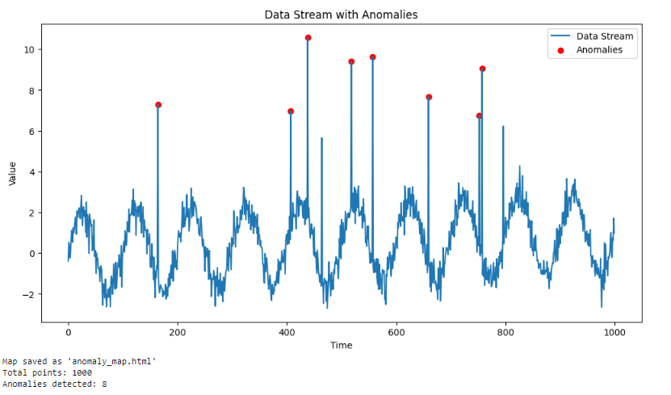

# Data Stream Anomaly Detection with GIS Visualization

This project implements an efficient algorithm for detecting anomalies in a continuous data stream, with an added GIS (Geographic Information System) visualization component.

## Features

- Real-time anomaly detection using Z-score method
- Data stream simulation with trend, seasonal components, and random anomalies
- GIS visualization of data points and detected anomalies
- Interactive map output using Folium
- Time series visualization using Matplotlib

## Requirements

To install the required packages, run:

```
pip install -r requirements.txt
```

## Usage

Run the main script:

```
python anomaly_detection.py
```

This will generate two outputs:
1. A Matplotlib plot showing the data stream and detected anomalies over time.
2. An interactive HTML map ('anomaly_map.html') showing the spatial distribution of data points and anomalies.

## Example Output

### Time Series Visualization


### GIS Visualization
An interactive map is generated as 'anomaly_map.html'. Open this file in a web browser to explore the spatial distribution of data points and anomalies.

## Code Structure

- `AnomalyDetector`: Class implementing the anomaly detection algorithm
- `generate_data_stream`: Function to simulate a data stream
- `generate_spatial_data`: Function to generate random spatial coordinates
- `visualize_stream`: Function to create the time series plot
- `visualize_gis`: Function to create the interactive GIS map

## Future Improvements

- Implement more sophisticated anomaly detection algorithms (e.g., ARIMA, Isolation Forests)
- Add real-time updating capabilities to the GIS visualization
- Incorporate actual geographic data for more realistic simulations
