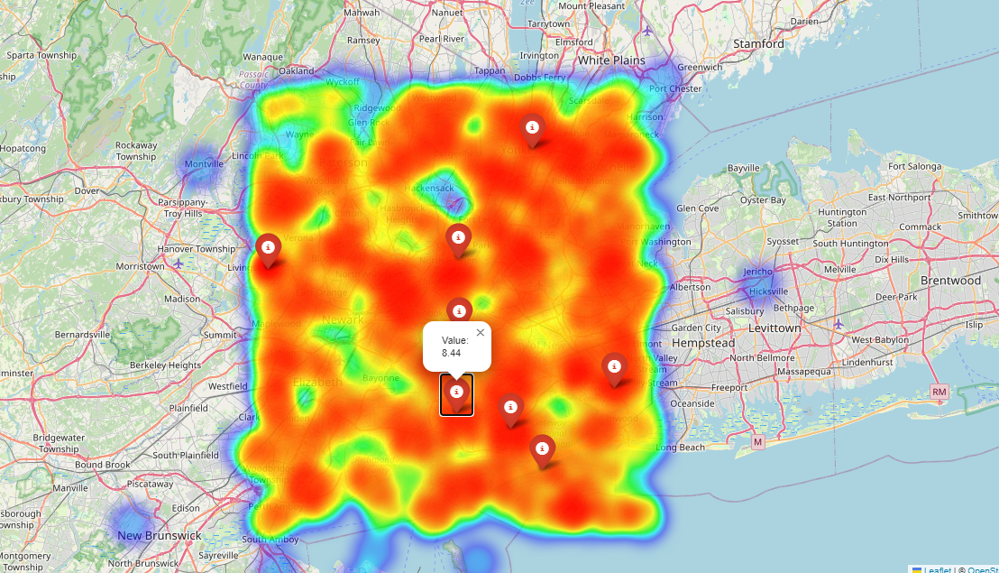

# Data Stream Anomaly Detection with GIS Visualization

This project implements an efficient algorithm for detecting anomalies in a continuous data stream, with an added GIS (Geographic Information System) visualization component.

## Features

- Real-time anomaly detection using Z-score method
- Data stream simulation with trend, seasonal components, and random anomalies
- GIS visualization of data points and detected anomalies
- Interactive map output using Folium
- Time series visualization using Matplotlib
## Algorithm Explanation

This project uses the Z-score method for anomaly detection. Here's a concise explanation of the algorithm and its effectiveness:

### Z-score Method

The Z-score method is a statistical technique for identifying outliers in a dataset. It works by measuring how many standard deviations away a data point is from the mean.

Algorithm steps:
1. Maintain a sliding window of recent data points.
2. For each new data point:
   a. Calculate the mean and standard deviation of the data in the window.
   b. Compute the Z-score: Z = (X - μ) / σ
      Where X is the new data point, μ is the mean, and σ is the standard deviation.
   c. If |Z| > threshold (typically 3), flag the point as an anomaly.
3. Update the sliding window with the new point.

### Effectiveness

The Z-score method is effective for anomaly detection due to several factors:

1. **Adaptability**: By using a sliding window, the algorithm adapts to gradual changes in the data distribution, making it suitable for detecting anomalies in non-stationary time series.

2. **Simplicity**: The algorithm is straightforward to implement and computationally efficient, allowing for real-time processing of data streams.

3. **Interpretability**: Z-scores provide a clear, interpretable measure of how unusual a data point is relative to recent observations.

4. **Sensitivity to Outliers**: The method is particularly good at detecting sudden spikes or drops in the data, which are often of interest in anomaly detection scenarios.

5. **Scale-Invariance**: Z-scores are scale-invariant, meaning the method works well regardless of the scale of the input data.
   
## Requirements

To install the required packages, run:

```
pip install -r requirements.txt
```

## Usage

Run the main script:

```
python anomaly_detection.py
```

This will generate two outputs:
1. A Matplotlib plot showing the data stream and detected anomalies over time.
2. An interactive HTML map ('anomaly_map.html') showing the spatial distribution of data points and anomalies.

## Example Output

### Time Series Visualization


### GIS Visualization
An interactive map is generated as 'anomaly_map.html'. Open this file in a web browser to explore the spatial distribution of data points and anomalies.


## Code Structure

- `AnomalyDetector`: Class implementing the anomaly detection algorithm
- `generate_data_stream`: Function to simulate a data stream
- `generate_spatial_data`: Function to generate random spatial coordinates
- `visualize_stream`: Function to create the time series plot
- `visualize_gis`: Function to create the interactive GIS map

## Future Improvements

- Implement more sophisticated anomaly detection algorithms (e.g., ARIMA, Isolation Forests)
- Add real-time updating capabilities to the GIS visualization
- Incorporate actual geographic data for more realistic simulations
